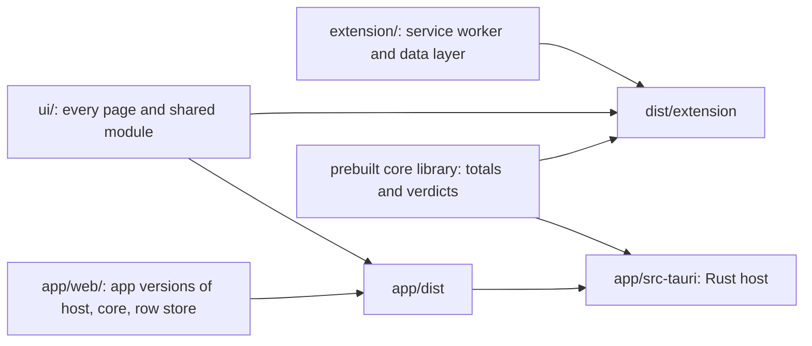

# Reeflect

TL;DR: Reeflect tracks the time you spend on each website and blocks a site when it passes your hourly, daily or weekly limit. It is a browser extension for Vivaldi and other Chromium browsers (Manifest V3, the current extension format). The same pages also run as a Tauri 2 app (a Rust shell around a web view) on Windows and Android. Languages: English, Spanish, French.

## What it does

- **Tracks** time per site, split into active, audio-playing and idle time.
- **Blocks** a site once its rule passes the limit, and shows a blocked page with a quote.
- **Shows** the data: dashboard, per-site and per-path views, a browsing timeline, a popup.
- **Manages storage**: prune, delete, export to JSON, import.
- **Syncs** between devices when you turn it on. The device encrypts every row before upload.
- **Tracks and blocks Android apps** in the Tauri app. See [android-app](docs/features/android-app.md).

## Requirements

| Tool | Why |
|---|---|
| Node.js (v24.13.1 used here, no minimum pinned) | runs every script in `scripts/os/` |
| Vivaldi or another Chromium browser | loads the extension |
| Rust 1.85 or newer | app only: builds `app/src-tauri/` |
| Android SDK and NDK, with `ANDROID_HOME` and `NDK_HOME` set | Android build only |

## Install / first run

```sh
npm install                        # Playwright, for capture and smoke tests only
node scripts/os/assemble.mjs       # links extension/ + ui/ into dist/extension
```

1. Open `vivaldi://extensions` (or `chrome://extensions`).
2. Turn on "Developer mode".
3. Click "Load unpacked".
4. Pick the `dist/extension` folder.

`dist/extension` holds links to the sources. Edit `ui/` or `extension/`, then reload the extension. Do not edit `dist/` or `app/dist/`. The next assemble removes both.

Run the app in development:

```sh
node scripts/os/assemble.mjs --app         # copies ui/ and the data layer into app/dist
cd app && npm install                      # the Tauri CLI, first time only
cd app && npx tauri dev --no-watch         # opens the desktop window
```

## Usage

1. Browse. Reeflect records time with no setup.
2. Click the toolbar icon, or press `Alt+Shift+C`, to open the popup.
3. Open the dashboard from the popup to see totals per site.
4. Open the rules page and add a limit for a site. The browser asks for access to that site.
5. Pass the limit. Reeflect redirects the site to the blocked page.

## How it works



The core computes every total and every block verdict. Its source lives outside this repo. Details: [architecture](docs/architecture/architecture.md).

## Tests and checks

All smoke tests need `node scripts/os/assemble.mjs` first. Each one opens a real Chromium window and prints `ok` or `FAIL` per check. The sync server is not in this repo. No formatter and no type-check command exist.

| Task | Command | Notes |
|---|---|---|
| Test blocking | `node scripts/os/enforce-smoke.mjs` | no server needed |
| Test dashboard and timeline | `node scripts/os/dashboard-smoke.mjs` | skips in the first 61 minutes of the local day |
| Test sync between 2 profiles | `node scripts/os/sync-smoke.mjs` | skips without a local sync server |
| Test the paused-sync state | `node scripts/os/sync-paused.mjs` | needs the same server |
| Test the Rust tracker | `cd app/src-tauri && cargo test` | unit tests in `tracker.rs` |
| Screenshot one page | `node scripts/os/capture.mjs --view dashboard --seed` | output in `shots/`; view names in `scripts/os/capture.config.mjs` |
| Check translations | `npm run lint:i18n` | the checker sits in the gitignored `.local/`, not in a fresh clone |
| Check changed docs | `node scripts/os/doc-lint.mjs --changed` | line budgets and TL;DR |

## Build

| Task | Command | Notes |
|---|---|---|
| Assemble for a zip | `node scripts/os/assemble.mjs --copy` | real copies |
| Assemble the app | `node scripts/os/assemble.mjs --app` | also copies the core `.so` into the Android project. Every `tauri android build` runs it first by itself; `tauri dev` does not |
| Build a debug APK for the emulator | `npm run android:debug` | for `x86_64`, the emulator's CPU type; installs as `app.reeflect.debug` |
| Build a release APK for a phone | `npm run android:release` | the one command: it assembles `app/dist`, builds for `aarch64`, the CPU type of current phones, then deletes `app/src-tauri/target/aarch64-linux-android` (5.5 GB), so every release build compiles from zero. **The APK comes out unsigned, and a phone refuses it, until you do the one-time [release signing](docs/features/android-app.md#release-signing) setup** |
| Prune the Rust build cache | `cargo sweep -t 14` in `app/src-tauri/` | deletes build files untouched for 14 days. See [build-target-cache](docs/appendix/build-target-cache.md) |
| Release the extension | push a `vX.Y.Z` tag | `.github/workflows/package.yml` attaches `reeflect.zip` to a GitHub release |

The extension has no compile step; `assemble.mjs` builds the folder the browser loads. Output: `dist/extension/` and `app/dist/`, both gitignored. APKs land in `app/src-tauri/gen/android/app/build/outputs/apk/universal/`, in `debug/` or `release/`. `app/native/<target>/` holds the prebuilt core library per platform, committed. Version source: `extension/manifest.json` for the extension, `app/src-tauri/tauri.conf.json` for the app. The Chrome Web Store upload is manual.

## Limits and known issues

- The `path` view throws `null.split` when the URL has no `ids` ([STATE.md](STATE.md)).
- The live tracker and the app blocking are Android code. The desktop app shows the pages only.
- Prebuilt core libraries exist for Windows x64, Android arm64 and Android x86_64. No macOS or Linux library exists.

## Privacy

All data stays on the device in `chrome.storage.local` and IndexedDB. Sync is off by default. With sync on, the device encrypts each row before upload; the server cannot read sites, times or device names. No analytics, no third-party code. Full text: [privacy policy](docs/privacy/privacy-policy.md).

## Project layout

| Path | What lives there |
|---|---|
| `ui/` | pages (`pages/<name>/`), shared modules, locales, icons |
| `extension/` | `manifest.json`, the service worker, the data layer, vendored code |
| `app/` | the Tauri app: `src-tauri/` (Rust), `web/` (app versions of shared modules), `native/` |
| `scripts/os/` | assemble, capture, smoke tests, doc-lint, git hooks |
| `docs/` | architecture, one doc per feature, privacy policy, appendix |

## Project notes

- [AGENTS.md](AGENTS.md) — instructions for AI coding agents that work in this repo.
- [STATE.md](STATE.md) — where the work stands. [DECISIONS.md](DECISIONS.md) — why. [docs/conventions.md](docs/conventions.md) — the code rules. [docs/README.md](docs/README.md) — the doc index.
