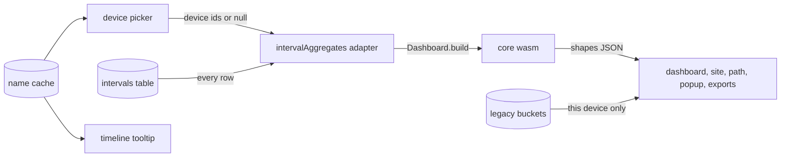

# Device filter UI

TL;DR: a device picker on the dashboard, site, path and timeline pages, and device names in the timeline tooltip. Every number comes from the core's `Dashboard` handle (design in reeflect-sync, `docs/appendix/device-filter-design.md`); this repo keeps rendering, the name cache and the legacy bucket days. Built 2026-09-12, verified by `scripts/os/dashboard-smoke.mjs`.

## Question
How does a user see one device or a chosen set on the dashboard, site page, path page and browsing timeline?

## Answer
- `src/data/intervalAggregates.js` is an adapter: it hands every row to `Dashboard.build(rows, deviceIds, time)` and reads the shapes as JSON. Same exports as before, plus `setDeviceFilter`, `getDeviceFilter`, `knownDeviceIds`. No row logic left in JavaScript.
- Picker: `src/shared/devicePicker.js`, a multi-select on the `custom-dropdown` pattern with an "All devices" entry, beside the range dropdown. Hidden when fewer than two devices own rows.
- Selection is page memory only. Every page open, including a site page reached from a filtered dashboard, starts at all devices.
- A device change clears the page's data caches and reloads, the same path the guided tour's reset uses.
- Timeline: the picker filters the drawn rows in page memory (the timeline draws rows, it does not aggregate them). Each tooltip line ends with the names of the devices present, omitted when only one device owns rows.
- Name cache: `_syncDeviceNames` in `chrome.storage.local`, written on every successful `devices()` call in `syncClient.js`. The picker triggers one such call when a device has no cached name; offline or signed out, an unknown id shows "This device" or its first 8 characters.

## Behaviour
| Case | Behaviour |
|---|---|
| Legacy bucket days | this device's data: read when this device is selected, empty when only other devices are (`mergeDataSources.js`) |
| Device without cached name | "This device" for this browser, otherwise the first 8 characters of the id |
| Signed-out device | listed while it still owns rows |
| Limits and blocking | untouched, combined across devices |
| Rebuild cost | ~470 ms on 30K rows in Chromium, measured by the smoke |

## Verification
`node scripts/os/dashboard-smoke.mjs`: 13 checks in a real Chromium profile with rows from two devices. Dashboard table per selection, picker labels, site page totals, timeline picker and tooltip name, no page errors. Screenshots land in `shots/smoke/`.

## Open
- Changelog entry and version bump for the release.
