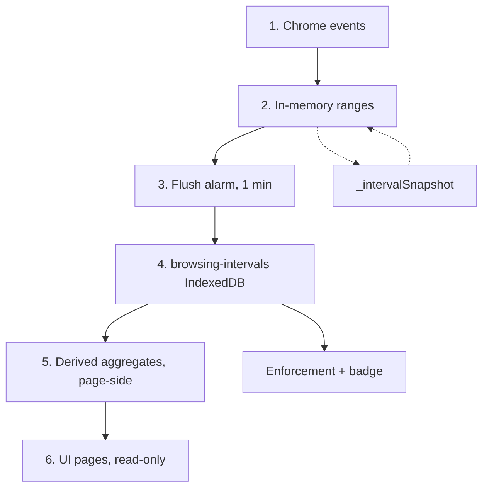

# Architecture

TL;DR: two halves. Tracking is an event-sourced aggregator — Chrome events become presence ranges, a 1-minute alarm writes them as rows to IndexedDB, and pages derive every total at read time. Enforcement is a pure limit checker that publishes redirect rules. Storage schema, read-path table and module map: [appendix](../appendix/architecture-reference.md).

Time totals and visit counts are **never stored**. Everything is derived from the interval rows, and the UI is strictly read-only over tracking data.

## Tracking flow

1. **Chrome events** — `chrome.tabs`, `chrome.windows`, `chrome.webNavigation`, `chrome.idle`.
2. **In-memory ranges** — `intervalTracker.js` keeps per-window and per-tab presence state keyed on `domain+path`; the range engine turns transitions into closed `[from, to)` ranges per `kind`.
3. **Flush alarm** — every minute `background.js` calls `flushNow()`, which recovers from the snapshot, reconciles window and tab state, applies idle clipping, and writes the pending ranges as rows.
4. **`browsing-intervals` IndexedDB** — one row per closed range `{ domain, path, kind, from, to }`, `kind ∈ active|audio|idle`, plus the sync fields `deviceId`, `localId`, `dirty`, `mirror`, `keyEpoch`. Rows pulled from other devices land in the same store with `mirror = 1`, so every reader below counts all devices. `overlap` (active ∩ audio) is not stored, nor are totals or visit counts.
5. **Derived aggregates** — `intervalAggregates.js` scans the rows and rebuilds the day and hour site and subpage shapes, visit counts, and the average-per-clock-hour series. Nothing is pre-aggregated.
6. **UI pages** — `dashboard`, `site` and `path` read through `loadMergedTrackingData`: interval rows stitched over the frozen legacy buckets for pre-interval days.

## Concepts

- **`siteId`** — eTLD+1 of a URL, via `siteResolution.js` and `tldts`.
- **`path`** — normalized URL path within a `siteId`.
- **interval row** — the only stored unit: a closed presence range `{ domain, path, kind, from, to }`.
- **`kind`** — `active` (in the focused window), `audio` (audible, unmuted tab), or `idle` (the active portion clipped off once the user passes the idle threshold).
- **`activeMs` / `audioMs`** — derived per-cell totals: the union of a domain's ranges of that kind within an hour, so parallel same-site windows count once, capped at one hour and summed into the day.
- **visits** — derived: the count of non-contiguous active intervals for a domain. Abutting path ranges are one interval, a real gap splits it, and `SESSION_GAP_MS` bridges sub-second seams. Navigating within a site does not bump it; leaving and returning does.
- **`dayKey` / `hourKey`** — `YYYY-MM-DD` and `YYYY-MM-DDTHH`, both local time.
- **stitch boundary** — `earliestDayKey()` is the first day with interval data. Earlier days read the frozen legacy buckets, that day and later read the interval log. Day and hour keys sort lexicographically, so a plain string comparison is the split.
- **snapshots** — the service worker can be killed at any moment, so `_intervalSnapshot` persists the in-memory range state and no time is lost between flushes.

## Storage ownership

The interval rows, the sync `deletes` queue and the sync `meta` store live in the `browsing-intervals` IndexedDB via Dexie. The four legacy bucket maps, `rules`, `_intervalSnapshot` and `storageVersion` live in `chrome.storage.local`. The bucket maps are **frozen** — read-only legacy with no live writer.

| Key | Writers | Readers |
|---|---|---|
| `intervals` (IndexedDB) | background (tracker flush); sync, for mirror rows and the `dirty` flag | pages via aggregates, background for enforcement and badge, sync for the push queue |
| `deletes`, `meta` (IndexedDB) | sync (`syncStorage.js`, `intervalLog.js`) | sync |
| `rules` | popup, rules page | enforcement (background), rules page |
| `sitesByDay` / `sitesByHour` | import, migrations, seed | pages via the stitch path, import/export |
| `subpagesByDay` / `subpagesByHour` | import, migrations | pages via the stitch path, import/export |
| `_intervalSnapshot` | background | background |
| `storageVersion` | migrations | migrations |

## Page read path

- There is no chrome message API any more — pages read storage directly. The `QUERY_*` constants in `queryTypes.js` are internal dispatch tags for the merged reader, a leftover name from the old message API.
- Pages call `loadMergedTrackingData({ type: QUERY_*, ...args })` in `mergeDataSources.js`, which splits the request at `earliestDayKey()` and dispatches per day: interval days through `intervalFetch`, earlier days through `bucketFetch`.
- In mock mode (the guided tour) fixtures are returned alone; when the log is empty every read falls through to buckets.
- Enforcement and the badge skip this reader and call `usageSince(windowStart)` directly for a light, uncached windowed aggregate.
- The full tag table is in the [appendix](../appendix/architecture-reference.md).

## Enforcement

- The verdict is the vendored core's: `computeOverage(rules, rows, windowStart, now)` in `enforcement.js` hands the rows that can reach into any rule's window to the wasm export, which aggregates them by local hour and day, sums each enabled rule over its period (`hour`, `day`, `week`) under its mode (`active`, `audio`, `active+audio`), and returns the over-limit and approaching (80% or more) sets. The extension only flattens each entry to its one web matcher.
- `publishOverage` reconciles `declarativeNetRequest` dynamic rules against that set, redirects matching open tabs to `blocked.html` while preserving the original URL for unblocking, returns tabs when a limit resets, and counts blocks into `blocksByDay`.
- Match types: `host`, `subdomain`, `pathPrefix`, `regex`, `keyword`. Details in [enforcement.md](../features/enforcement.md).
- No windowed aggregate exists in JavaScript any more. The badge asks the core the same way, for one site and today only.
- The flush alarm runs `flushNow()` then `checkEnforcement()` in order, so enforcement never reads pre-flush usage, and a pre-emptive `webNavigation.onBeforeNavigate` drain re-checks limits before the next tick.

`rules` is managed by the rules page and the popup, and read by enforcement and the rules page.
