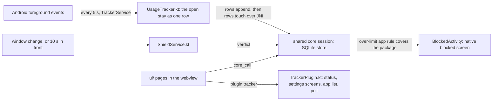

# Android app

TL;DR: the Tauri app runs the shared `ui/` on the native core. The tracker and the block live in Rust (`app/src-tauri/src/tracker.rs`, `android.rs`); Kotlin only declares the two services Android needs and hands them events. Each service needs a permission the user grants from the settings page.

## Flow

## What each part owns

| Part | Owns | Never does |
|---|---|---|
| `tracker.rs` (Rust) | what a stay is: which events open, extend and close the one row of the app in front; which over-limit rule covers a package; the blocked page's route. Unit-tested | platform calls |
| `keystore.rs` (Rust) | the key at rest: the core's DEK wrapped by an AES-256-GCM key that never leaves the Android Keystore (alias `dek`), through the platform's own Java classes over JNI; the core calls `wrap` and `unwrap` when it stores or loads the key | Kotlin |
| `android.rs` (Rust) | the JNI entry points the services call: `since`, `tick`, `check`, `syncRun`; the tracker's state file; the core's shared session; the route `check` leaves for the pages (a static, read by `pending_route`) | UI |
| `TrackerService.kt` | the persistent notification; every 5 s the system's events since the last poll, as JSON, to `Native.tick`; `Native.syncRun` every 15 min; restarted by the system and at boot (`BootReceiver.kt`) | decide anything |
| `ShieldService.kt` | window-change events and a 10 s timer to `Native.check`; brings the app to the front when it answers a route | decide anything; reading screen content (`canRetrieveWindowContent=false`) |
| `TrackerPlugin.kt` | what the pages may ask: the three permissions, the two system screens, the notification prompt, the installed app list; starts the service on app open | logic |

## Rules for apps

An app rule is `{ matchType: "exact", source: "app", target: <package>, label }` plus the limit fields, added from the Apps tab of the rules page (shown only where `host.apps` exists). The extension lists such a rule but never enforces it: its enforcement keeps web matchers only. When the rule is over, the app opens the same `blocked.html` the extension redirects to, with `rule`, `blockKey` and `site`.

## Permissions

| Permission | Granted where | Used by |
|---|---|---|
| Usage access (`PACKAGE_USAGE_STATS`) | system "Usage access" screen, opened from the settings card | tracker |
| Accessibility service | system "Accessibility" screen, opened from the settings card | shield |
| Notifications (`POST_NOTIFICATIONS`, Android 13+) | runtime prompt from the settings card | the service's persistent notice |

## Verified on the emulator (2026-09-14)

Fresh install, both permissions, an app rule on Settings with limit 0: opening Settings put `BlockedActivity` in front. The sync page registered an account against a local Worker and pushed the tracked rows; the key file then holds the keystore's blob, not the raw key, and a restarted app still syncs. After a reboot the service tracked Settings with no activity open. The headless emulator paints the webview white; page state is read through the Chrome DevTools protocol on `webview_devtools_remote_<pid>`. Reinstalling the package clears the enabled accessibility services: put `enabled_accessibility_services` again after the app has started.

## Not yet

A web-block (`VpnService`). A Play listing is out of scope (owner).
