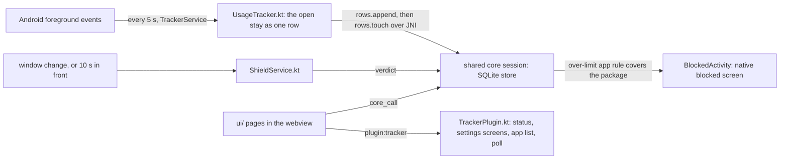

# Android app

TL;DR: the Tauri app runs the shared `ui/` on the native core. The tracker and the block live in Rust (`app/src-tauri/src/tracker.rs`, `android.rs`); Kotlin only declares the two services Android needs and hands them events. Each service needs a permission the user grants on the first-launch screen or from the settings page.

## Flow



## What each part owns

| Part | Owns | Never does |
|---|---|---|
| `tracker.rs` (Rust) | what a stay is: which events open, extend and close the one row of the app in front; which over-limit rule covers a package; the blocked page's route. Unit-tested | platform calls |
| `keystore.rs` (Rust) | the key at rest: the core's DEK wrapped by an AES-256-GCM key that never leaves the Android Keystore (alias `dek`), through the platform's own Java classes over JNI; the core calls `wrap` and `unwrap` when it stores or loads the key | Kotlin |
| `android.rs` (Rust) | the JNI entry points the services call: `since`, `tick`, `check`, `syncRun`; the tracker's state file; the core's shared session; the route `check` leaves for the pages (a static, read by `pending_route`) | UI |
| `TrackerService.kt` | the persistent notification; every 5 s the system's events since the last poll, as JSON, to `Native.tick`; `Native.syncRun` every 15 min; restarted by the system and at boot (`BootReceiver.kt`) | decide anything |
| `ShieldService.kt` | window-change events and a 10 s timer to `Native.check`; brings the app to the front when it answers a route | decide anything; reading screen content (`canRetrieveWindowContent=false`) |
| `TrackerPlugin.kt` | what the pages may ask: the three permissions, the two system screens, the notification prompt, the installed app list; starts the service on app open | logic |

## Rules for apps

An app rule is `{ matchType: "exact", source: "app", target: <package>, label }` plus the limit fields, added from the Apps tab of the rules page (shown only where `host.apps` exists). The extension lists such a rule but never enforces it: its enforcement keeps web matchers only. When the rule is over, the app opens the same `blocked.html` the extension redirects to, with `rule`, `blockKey` and `site`.

## Permissions

| Permission | Granted where | Used by |
|---|---|---|
| Usage access (`PACKAGE_USAGE_STATS`) | system "Usage access" screen, opened from the settings card | tracker |
| Accessibility service | system "Accessibility" screen, opened from the settings card | shield |
| Notifications (`POST_NOTIFICATIONS`, Android 13+) | runtime prompt from the settings card | the service's persistent notice |

The app asks for all three before anything else. `ui/shared/permissionIntro.js` paints one fullscreen panel per permission, swiped sideways, and the guided tour waits for it. The screen returns on every launch until the user reaches the last panel. After that the dashboard carries a subheader while a permission is missing, and that subheader reopens the same panels.

## Release signing

`npm run android:release` writes `app-universal-release-unsigned.apk` until a signing key exists. Android refuses to install an unsigned APK. The setup is one time; after it, every release build is signed with no extra flag.

1. Make the key. Back this file up. If you lose it, the phone refuses every later update until you uninstall the app, and that deletes its data.

```powershell
& "$env:JAVA_HOME\bin\keytool.exe" -genkey -v -keystore $env:USERPROFILE\reeflect-upload-key.jks `
  -storetype JKS -keyalg RSA -keysize 2048 -validity 10000 -alias upload
```

2. Create `app/src-tauri/gen/android/keystore.properties`. It is gitignored because it holds the password in plain text.

```properties
password=<the password from step 1>
keyAlias=upload
storeFile=C:\\Users\\<you>\\reeflect-upload-key.jks
```

3. Run `npm run android:release`. The output is `app/src-tauri/gen/android/app/build/outputs/apk/universal/release/app-universal-release.apk`.

`app/build.gradle.kts` reads the file and signs the `release` build type. File missing: no error, the same unsigned build. After a `tauri android init` that re-creates `gen/android`, do step 2 again.

## Icon

Every app icon, desktop and Android, comes from the extension icon `ui/resources/icons/brand/icon.svg`. After that file changes, run `npx tauri icon src-tauri/icons/source/icons.json` in `app/`. The command also writes `icons/ios/` and `icons/64x64.png`; nothing uses them, delete them.

The Android launcher crops its icon layer to the centre two thirds. `icons/source/android-foreground.svg` is the same picture at 2/3 scale, with the sky and the water extended to the edge. It copies the paths of `icon.svg`: a change to the drawing goes into both files.

## Verified on the emulator (2026-09-14)

Fresh install, both permissions, an app rule on Settings with limit 0: opening Settings put `BlockedActivity` in front. The sync page registered an account against a local Worker and pushed the tracked rows; the key file then holds the keystore's blob, not the raw key, and a restarted app still syncs. After a reboot the service tracked Settings with no activity open. The headless emulator paints the webview white; page state is read through the Chrome DevTools protocol on `webview_devtools_remote_<pid>`. Reinstalling the package clears the enabled accessibility services: put `enabled_accessibility_services` again after the app has started.

## Not yet

A web-block (`VpnService`). A Play listing is out of scope (owner).
