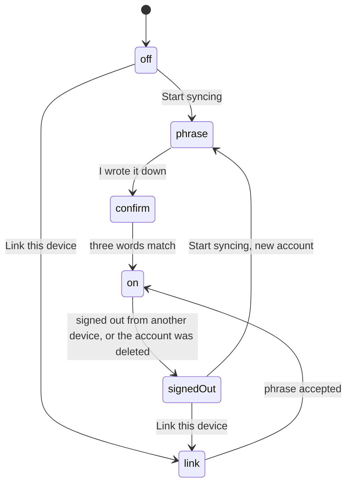

# Cloud sync

TL;DR: shipped in 1.4.0. Cross-device sync of the interval log, end-to-end encrypted, opt-in, with a 24-word recovery phrase as the only credential and no personal information collected. The server and the shared core are developed outside this repo; this page is the extension's side only.

## What the user gets

- **Start syncing** creates an account from a fresh recovery phrase, shows the 24 words once, and asks for three of them back before continuing.
- **Link this device** joins an existing account by typing the phrase; the device then downloads every other device's rows.
- **Progress on every page**: while a run is on (upload, download, the server check, a merge) a bar under the header on every page shows the phase and the count, as "Uploading your history… 1,240 of 8,000". The run belongs to the host (the extension's background worker, the app's backend), so leaving or reloading a page changes nothing; the bar reappears on the next page. A browser closed mid-upload finishes at the next start. While syncing is paused the subheader shows the wait, with no bar.
- **Devices** lists every device on the account with a rename, sign out and forget action, and, on every other device, **Merge into this device**: for a reinstall that came back as a new device, its history moves under this one and it leaves the list on every device. A merge that stops part way (a lost connection, a server error) stays on the bar of every page with the count it reached and a Retry; the next successful sync resumes it on its own, and Retry does so at once; either way it continues where it stopped, and the moved rows come back from the server as this device's own. The merged device stays retired: linking it again would upload its rows a second time. Names are encrypted like the rows.
- **Recovery phrase** can be shown again at any time. **Stop syncing everywhere** deletes the account on the server and leaves each device's local data alone.
- Limits count usage from **every synced device**: a rule on this device applies to the combined interval log. Rules themselves stay per device.
- No passphrase and no unlock. The data key rests on the device, so a browser restart never prompts for anything.

## States of the Sync page

While a run is in flight the status card shows live upload progress and disables Sync now. A browser runs one sync at a time: a run started while another is going, from the alarm or the page, is skipped. When the server asks a device to wait, the card says syncing is paused and when it resumes, and the device stops retrying until then. Nothing user-facing says why.

## What lives here

| Piece | Where |
|---|---|
| Every account action and the sync run | `ui/shared/syncClient.js`, driving the vendored core in `extension/src/vendor/reeflect-core/` |
| Storage host the core calls back into | `extension/src/data/syncStorage.js` |
| Row schema v2: `deviceId`, `localId`, `dirty`, `mirror`, `keyEpoch`; the `deletes` queue and `meta` store | `extension/src/data/intervalLog.js` |
| The alarm, 1 to 5 minutes, tighter with more devices and stricter limits | `extension/src/background/sync.js` |
| The page and the settings card | `ui/pages/sync/`, `ui/pages/settings/` |
| Data key at rest | `chrome.storage.local` |
| Tests, real Chromium profiles through the page | `scripts/os/sync-smoke.mjs` (26 checks), `scripts/os/sync-paused.mjs` (7) |

The extension's CSP carries `wasm-unsafe-eval` for the core. Rows pulled from other devices sit in the same `intervals` table with `mirror = 1`, so every existing reader counts all devices without change. The legacy scalar buckets stay local and frozen.
